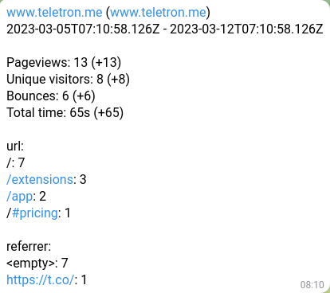

# umami-report

Generate a summary for your websites tracked with [umami](https://github.com/umami-software/umami). This package
connects to the [umami API](https://umami.is/docs/api) to retrieve statistics for your websites.

This package will:

1. Retrieve a list of available websites
2. Retrieve the data for each of the found websites
3. Send the consolidated list of data to one or more of the configured output methods.



_The content of the report in Telegram is pretty basic. Any Pull Requests to improve its layout are welcome!_

## Usage

    npx umami-report -c config.json

That's it! See [Configuration](#Configuration) for what to put in the configuration file.

### Options

| Option | Description                             |
| ------ | --------------------------------------- |
| -c     | The location to the configuration file. |
| -h     | Display help text.                      |

## Configuration

Check the [json-schema](src/configuration/validator.ts) and the [typescript type](src/types/index.ts) for the structure
of your configuration file.

A very basic sample:

```json
{
  "auth": {
    "token": "xxx"
  },
  "endpoint": "https://umami.example.com",
  "output": {
    "file": {
      "path": "report.json"
    }
  }
}
```

This example will use a provided token to retrieve the data and store the output to `report.json` in the current directory.

The definition:

```ts
export type Configuration = {
  auth: {
    username?: string;
    password?: string;
    token?: string;
  };
  endpoint: string;
  exclude?: string[];
  include?: string[];
  period?: number;
  metrics: Array<'url' | 'referrer' | 'browser' | 'os' | 'device' | 'country' | 'event'>;
  output: {
    file?: {
      path: string;
      output?: 'text' | 'json';
    };
    telegram?: {
      token: string;
      chatId: string;
    };
    webhook?: {
      url: string;
      output?: 'text' | 'json';
    };
  };
};
```

### Auth

There are two different ways to authenticate to retrieve the data. If you provide
a username and password the Umami API will be used to retrieve a token.
If you already have a token you can provide that directly.

| Option   | Description                                                    |
| -------- | -------------------------------------------------------------- |
| token    | If you have it, provide the token to use to retrieve the data. |
| username | The username to retrieve a new token with.                     |
| password | The password to retrieve a new token with.                     |

Provide either a token, or a username/password combination.

For more details, see the [Authentication](https://umami.is/docs/api) header
in the API documentation section.

### Endpoint

The URL of your running Umami instance. Only the base URL is needed, the `/api` prefix
is added by the script itself. This value is required.

### Exclude

An optional array of website UUIDs to exclude from the report. The UUID of a website
can be found by visiting the dashboard of the specific website. The URL then
contains the UUID. For example: `/websites/a2f36506-87b3-4c47-b2d2-eaf52de9039f/www.teletron.me`, `a2f36506-87b3-4c47-b2d2-eaf52de9039f` is the UUID of the site.

### Include

An optional array of website UUIDs that need to be included in the report. All
other websites are ignored. This setting is mutually exclusive with `Exclude`, they
cannot both be provided. See the section on [Exclude](#Exclude) on how to determine the
UUID of a website.

### Period

The number of days for which to generate the report. For example for the last 24 hours pick `1`, for the last week, select `7`. The default value is `7`.

### Metrics

These are the metrics to include in the report. The script will select the top 5 results
for each metric and display those in a descending order. If no value is provided then all metrics will be reported on.

Possible values are: `'url' | 'referrer' | 'browser' | 'os' | 'device' | 'country' | 'event'`.

### Output

One or more output methods can be configured to send the data to after the report has been generated.

### Output - File

Send the output of the report to a JSON or text file on the file system. Provide a
`path` parameter, this is the filename where the file will be saved. Set the `output`
attribute to `json` or `text` do determine the type of output.

See [docs/sample-output.json](docs/sample-output.json) for an example of what the
output is.

### Output - Telegram

Send a report in text format to a Telegram conversation using a Telegram bot.
All you need is your bot `token` and the `chatId` you want to send the message
to.

For more information on Bots in Telegram visit [telegram.org/bots](https://core.telegram.org/bots).

### Output - Webhook

Send the output of the report to HTTP URL via POST. Specify the `url` to send the
report to. Set the `output` attribute to `json` or `text` do determine the type of output.
You can use a service like [webhook.site](https://webhook.site) to perform any tests you'd like.

You can use this functionality to transform the report and deliver it through a different
medium, such as slack or email.

See [docs/sample-output.json](docs/sample-output.json) for an example of what the
output is.

## Other projects

Checkout these other projects that have been built by [@daangemist](https://github.com/daangemist):

- [teletron](https://www.teletron.me), Build personal dashboards. Visualize and make your most important information available at a glance.
- [observalyze](https://www.observalyze.com), Get insight into how your application is used by its users.

## Roadmap

This is a basic implementation. There are some improvements to be made, such as:

- Better report formatting
- E-mail support
- HTML formatting

Create an [issue (or pull request)](https://github.com/daangemist/umami-report/issues) if there are some specific details
you require.

## Telemetry

This package uses [observalyze](https://www.observalyze.com) to get an idea of its usage. No privacy information is tracked,
only a counter is updated when the process is started.

## Contributing

Contributions are welcome. This does not necessarily have to be code, it can also be updated documentation, tutorials, bug reports or pull requests.

Please create an [issue](https://github.com/daangemist/umami-report/issues?q=is%3Aissue+is%3Aopen+sort%3Aupdated-desc) to propose a feature you want to implement, so that the details can be discussed in advance.
